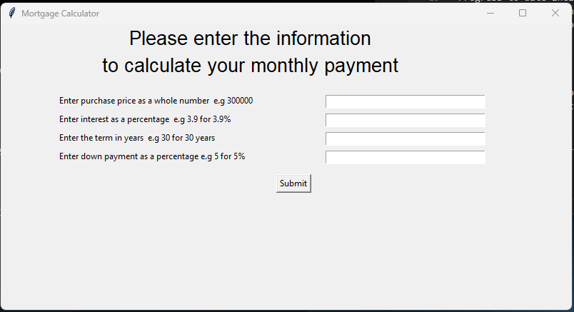
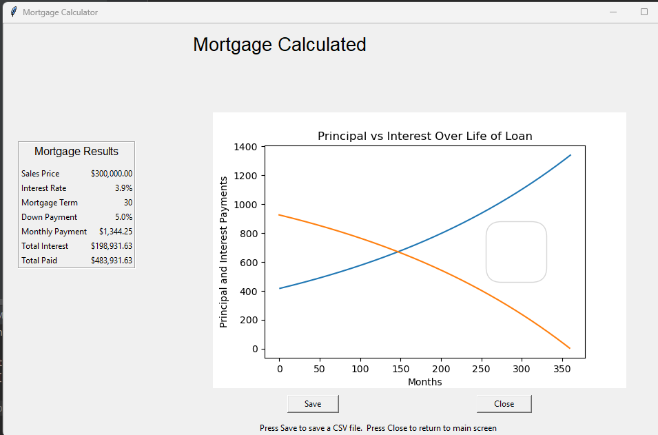

# NCLAB-Capstone-Project

Financing Calculators

version 1.1

Section 1

The following program uses various modules to calculate the following information for the user

1. Initial payments for purchase of a house
2. Refinancing an existing mortgage
3. What if I make an additional payment to principal?
4. Sales proceeds when the house sells

Section 2

Modules used

1. Numpy  pip install numpy
2. Pandas pip install pandas
3. Tkinter pip install tk
    a. Messagebox
    b. Filedialog
4. Locale pip install locale
5. Matplotlib pip install matplotlib
    a. FigureCanvasTkAgg
    b. Figure

In order to save to Excel, openpyxl will need to be installed using pip install openpyxl
    if using Anaconda, it will be necessary to add openpyxl in the environment.    

Section 3    

The program will be utilizing Tkinter as the GUI.

The program starts with options for the user.

Currently, the only option working is the mortgage calculation.
The option to close the program has been added, when the user has completed the task.

When the user presses submit for the mortgage calculator, this is the screen that appears

Once the information is entered, a check is made to ensure 
the information entered is accurate.
If not, the user will receive an error message.

Once the information is submitted, the user is given the option to verify the information submitted.
The user can choose to keep the information and press submit or make changes in the fields.

Once again, checks are made to ensure the correct information is entered.  Once entered the results
will be displayed along with a graph showing principal and interest payments over each month.  

The user will have the option to save the ammortization file as a .csv  or .xlsx file on the local computer
utilizing filedialog.asksaveasfilename.

Once saved, the file returns to the last screen with a pop up message stating the file has saved.  If the user
presses cancel, the screen closes.

Once closed, the program will revert to the first window, giving the user the option to 
complete a new task or end the program.

Section 4

Errors encountered

1.  Unable to add the legend to the graph.

Section 5

Future improvements

1. add functionality for refinancing
2. add functionality for additional payments
3. add functionality for sales proceeds
4. give user options to choose different charts(graphs) to view.
5. add optional fields to consider mortgage insurance, homeowners insurance
   and property taxes

Section 6

Changes

This section will include changes to the program for new versions.

